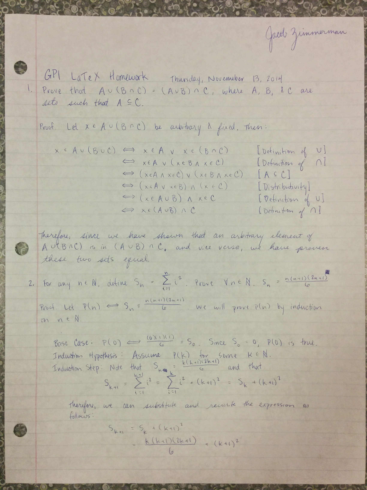
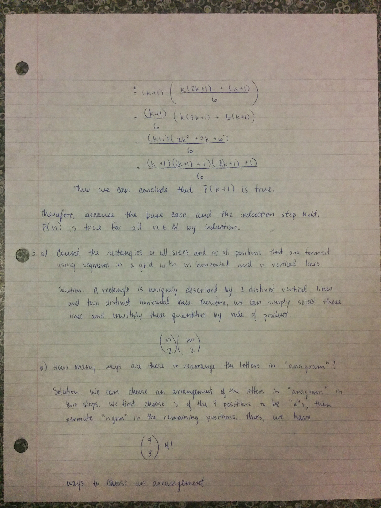

# Example LaTeX Document

## `homework` document class

This is a "reference" solution for the sample math homework given below. It is
only one of many, many ways to accomplish this. In particular, this solution
differs from many solutions in that it uses a custom _document class_. This
custom document class is defined in the file `homework.cls`, and we specify that
we want to use that class in the first line of `written.tex`:

```tex
\documentclass{homework}
```

Normally, this is the more standard `\documentclass{article}`, which is a
built-in document class.

You can read more about the `homework` LaTeX class [at this link][0].

[0]: https://github.com/jez/latex-homework-class


## Compiling

The `Makefile` contains a number of targets that let you compile the LaTeX file
to a PDF if you have `pdflatex` installed (see the course website for some
pointers on how to install this). In particular, you can run `make view` to
compile the PDF and open it in your default PDF viewer.

You can reuse this Makefile in every LaTeX homework you'll create. The only
thing that you will have to change is the first line of it:

```make
TARGET=written
```

For this assignment, we've called our LaTeX file `written.tex`, and the value of
this `TARGET` variable is set appropriately. Just make sure to change it if you
call your LaTeX file something else.

## Problem

The `written.tex` file in this repo converts the pictures below to LaTeX.




## Solution

Here's the [compiled output](written.pdf) of the sample solution in this repo.

